# Singapore Bus Telegram Bot

###### Go to [Singapore Bus Bot](https://t.me/SINGA_Bus_Bot) to use the bot.

## Introduction:
This Telegram bot is created to give users bus arrival timings in Singapore without the need to use 
applications such as Singabus or MyTransport.SG. Users can share their current location or type in keywords of
their location to receive a list of nearby bus stops. Frequently visited bus stops can be added to favourites
by users in order to view the bus arrival timings of those bus stops more conveniently. 

If you take a bus at a specific time daily (to go to school/work etc.), you can schedule a message which will be sent
at a specific time daily (depending on your schedules) to better plan your transport journey. You can also view
MRT updates in the event of a train breakdown/delay, where shuttle bus services and additional travelling time 
information will be available. 

Note that since this bot is hosted on Heroku with a free plan, the bot may take a while to start up from 2345 SGT 
to 0515 SGT daily (for about 15 to 20 seconds). Aiyo, go out so late & wake up so early for what! Go sleep. Haha...

## User Guide:
Below is a list of commands users can use:

- /start : To start the bot
- /bus : Bus stop location
- /favourites : View saved bus stops
- /add_favourites : Save a bus stop to favourites
- /mrt : View MRT updates and MRT map
- /settings : Schedule bus arrival messages and opt in/out MRT alert messages
- /feedback : To send feedbacks/bugs to admin
- /stop : To stop the bot

## Starting the bot:
To start the bot, send /start.

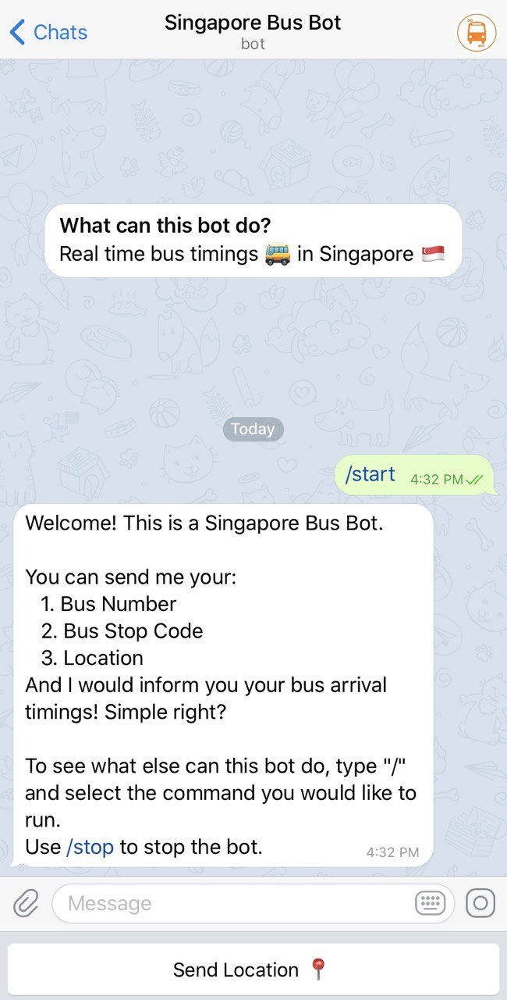

## Bus Stop Location and Bus Timings:
Send /bus to share your current location and the bot will return you a list of nearby bus 
stops (350m radius from current location). 

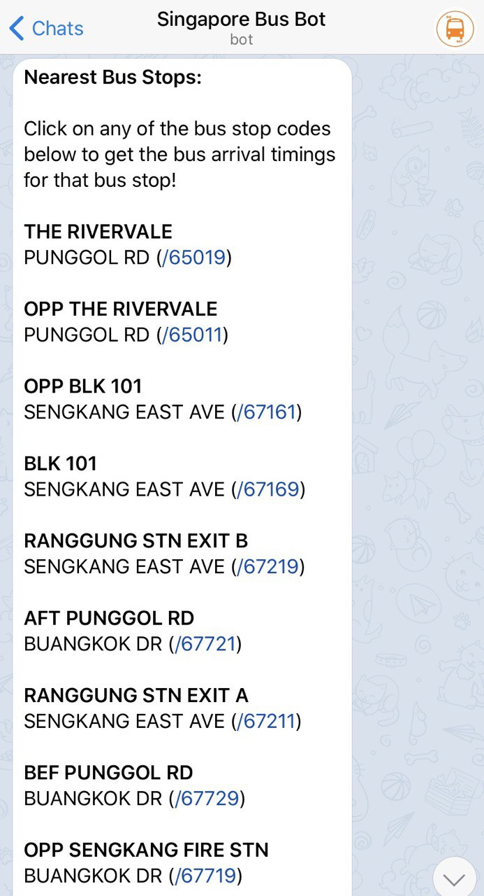

Alternatively, you can directly type in a bus stop code (14141) / bus number (80) / keywords of current location 
(Vivocity).

Click on a bus stop code you are looking for. The location of the bus stop and the bus arrival timings of the bus stop 
will be sent to you. 

By default, the message will be in General Format - only the next bus timing will be shown. 
You can refresh the bus arrival timings by clicking on the 'Refresh' button.

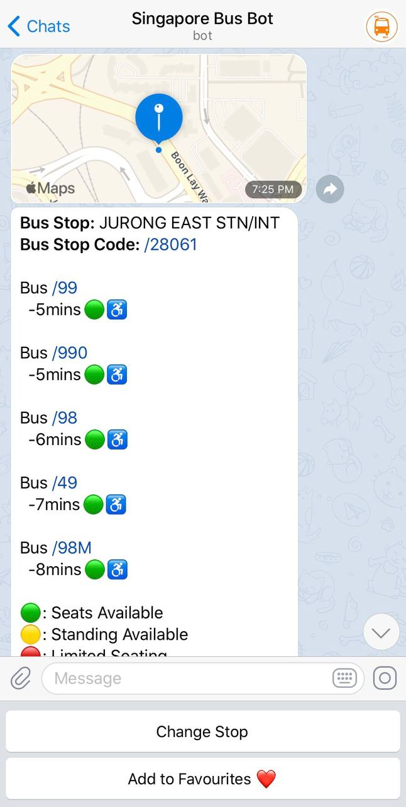

Click the 'Detailed Format' button at the bottom of the message to view the next 3 bus timings. 

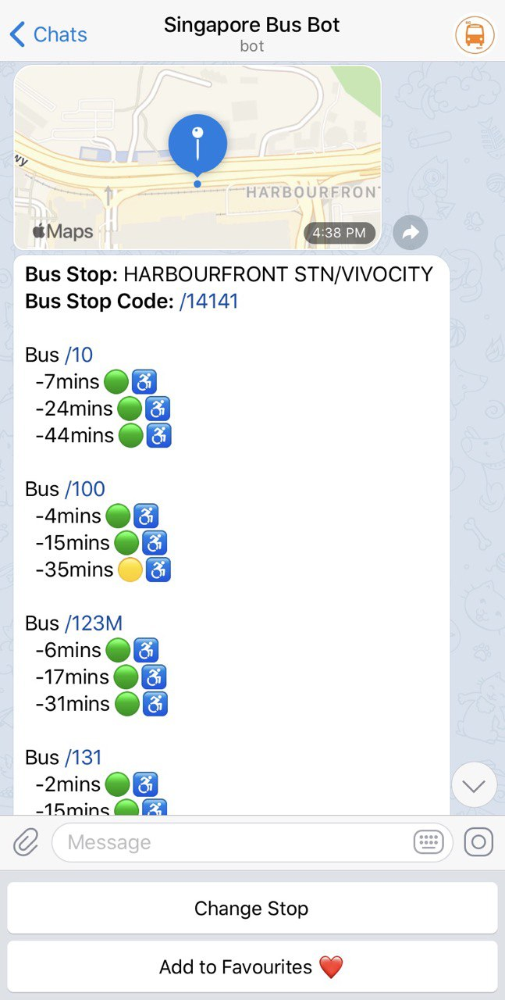

Coloured circle emoji - Green, Yellow, Red found beside the bus timings represent the availability of seats in that bus. 
Green represents presence of seats, yellow represents there are standing space available while red represents limited seating.

A wheelchair emoji will be present if the bus is wheel-chair accessible.

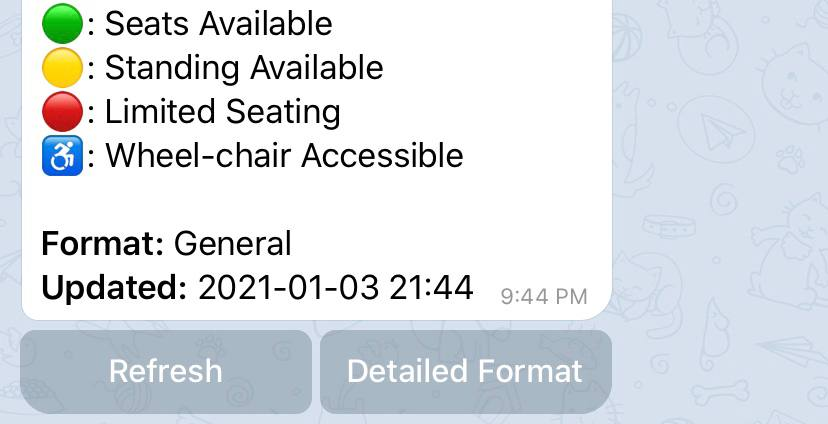

A list of bus routes taken by a specific bus can also be found by typing the bus number and clicking on the 'Bus Routes' button.

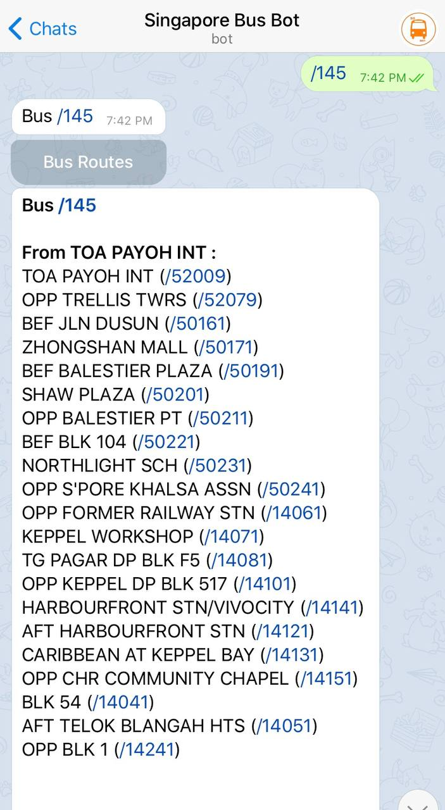

## Favourites
You can view your favourite bus stops by sending /favourites

## Add favourites
To add a bus stop to your favourites, sending /add_favourites, followed by your bus stop code (e.g. /add_favourites 14141). 
Alternatively, you can type in your bus stop code and click on the 'Add to Add to Favourites ❤' KeyBoard Button.
For convenience, you can rename your favourite bus stops. No more remembering weird and long bus stop names.

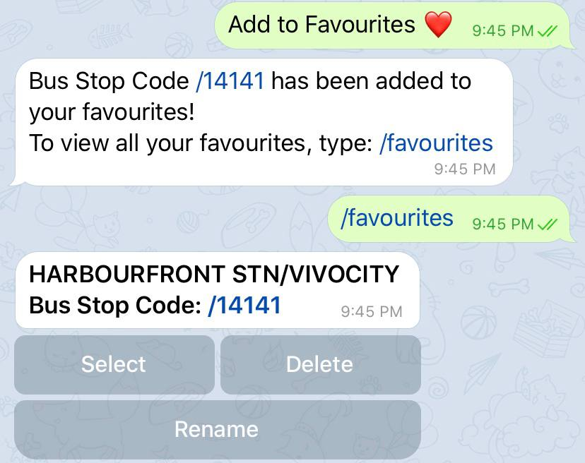

## MRT updates/map
To check on MRT service alerts, send /mrt and click on the 'MRT Service Alerts' button. 
To view the MRT map, click on the 'MRT Map' button.

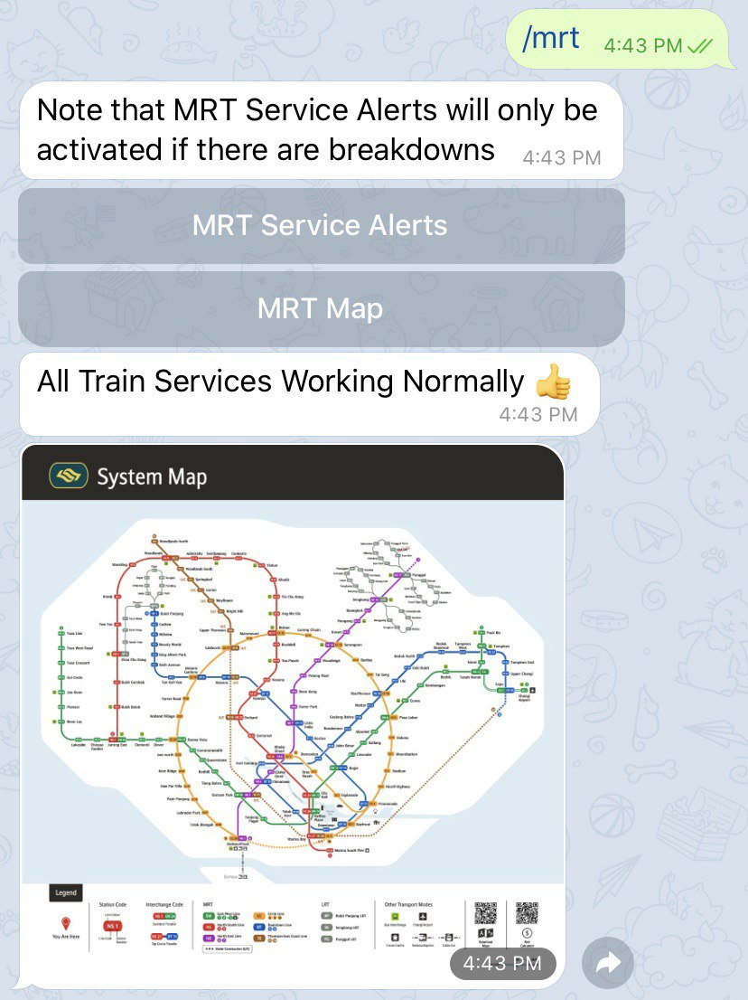

If there is any MRT breakdowns/delays, a message like this will be sent to users. This occurred on 28 Dec, when there 
is a signalling fault along Downtown Line. Shuttle bus information will be included in the message as well if applicable.

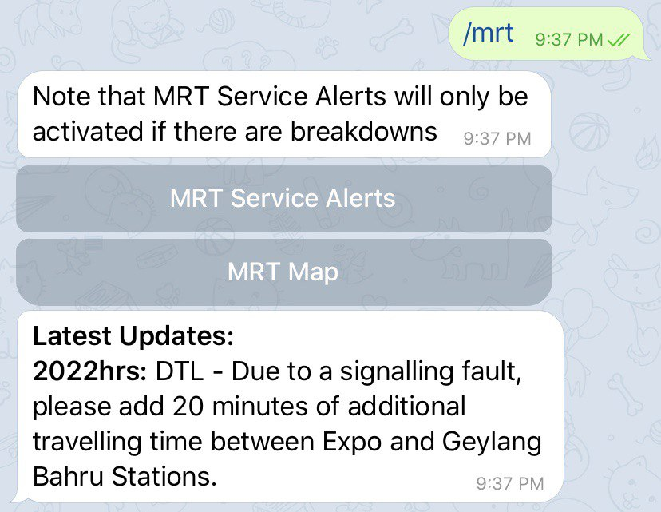

## Settings
Send /settings to schedule message and opt in/out of MRT service alerts.

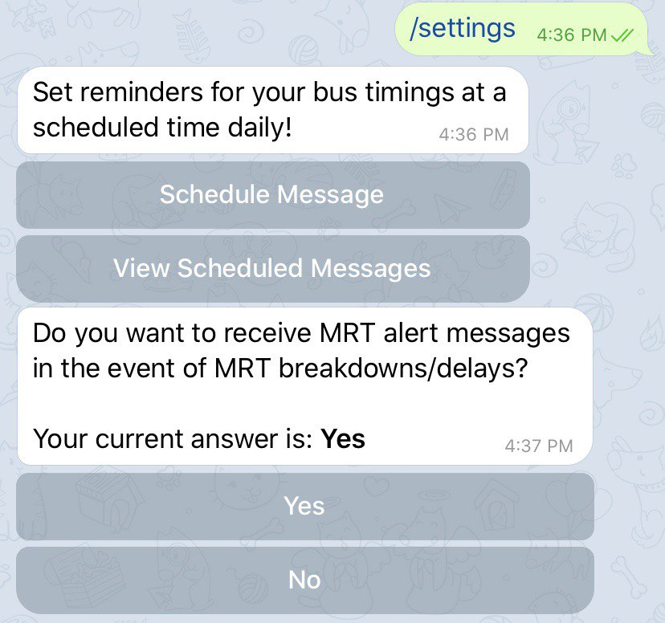

To schedule a message to receive the bus timings at a specific time daily, click on the 
'Schedule Message' button. Next, send a 5 digit bus stop code. Select the buses that you want their timings to be sent 
to you. If you click 'Confirm' without selecting any bus stops, by default, all bus timings will be sent. 
You can select up to 5 buses in one scheduled message. When prompted to key in a time, type in a time that 
follows the 24 hr format (e.g. 0630 to represent 6:30AM) and submit. Do note that when you are scheduling a message, 
you have to complete the entire process (enter bus stop code and timing). You will not be allowed to check bus timings 
while scheduling message. To stop, send /exit. 

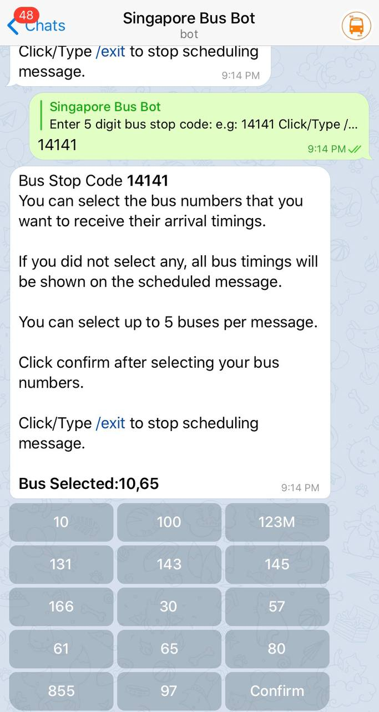

To view all your scheduled messages, click on the 'View Scheduled Messages' button. You can remove a schedule by 
clicking on the 'Remove' button. 

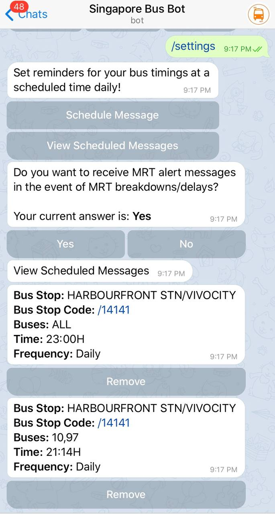

An example of a scheduled message sent to user, who selects the buses that he wants the timings to be sent, is shown below.

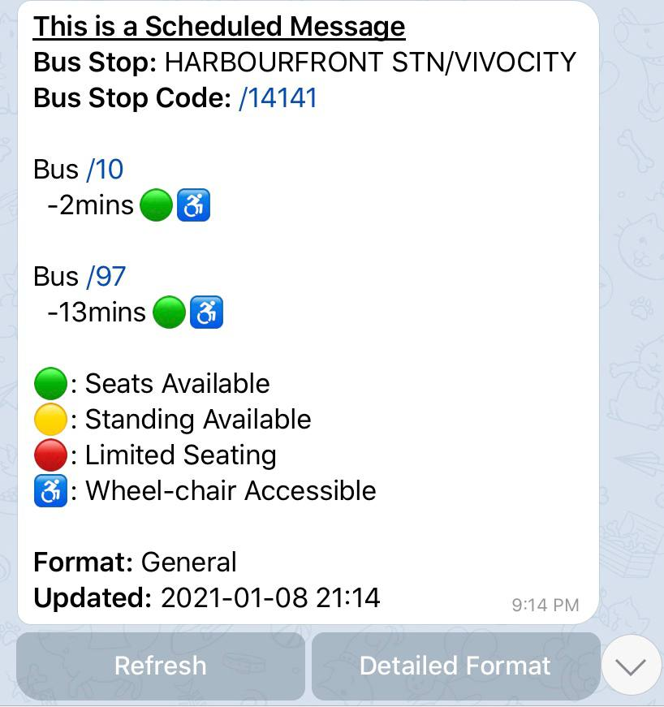

You can also choose whether to automatically receive MRT alert messages in the event of MRT breakdowns/delays. 
The default option is 'Yes'.

## Feedbacks
To send a feedback or report a bug, send /feedback. Then, type in your feedback and we will look into it ASAP. 
Do note that once you send /feedback, you are required to give a feedback. To quit, send /exit.

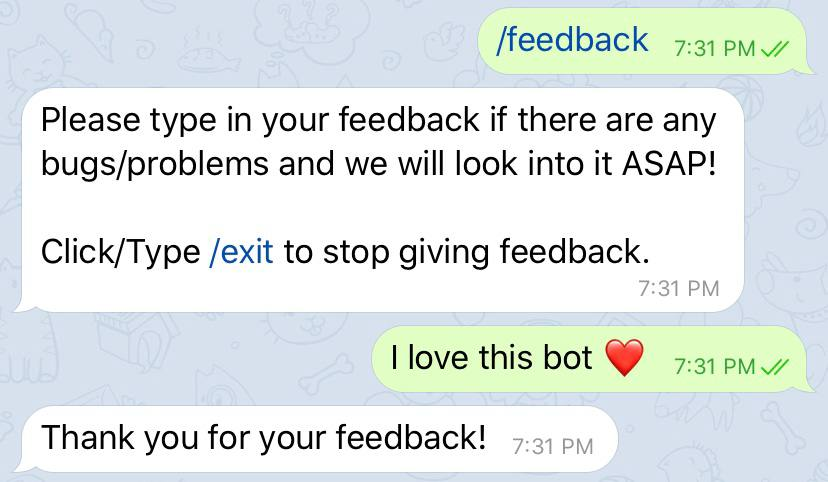

## Stop bot
To stop a bot, send /stop. Your past messages with the bot will not be removed unless you delete them intentionally.

## Possible improvements in the future:
- Customise schedule messages
- Allow users to select a range of distances to find nearest bus stops
- Allow users to send screenshots for feedbacks
- Allow users to rename favourite bus stop 

## Version:
- V1.0 : 01/01/2021 : Release of Singapore Bus Telegram Bot.

## License:
This project is under the [MIT](https://github.com/spartan737/sg-bus-telegram-bot/blob/master/LICENSE) license.